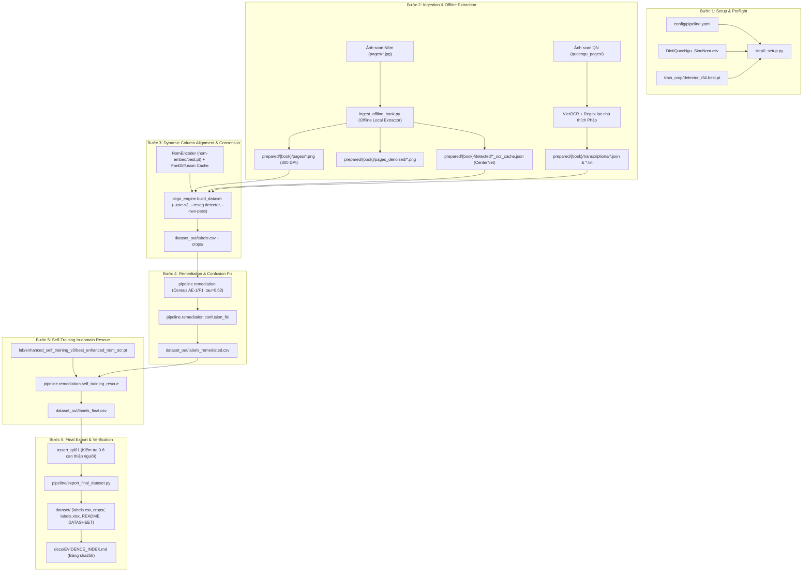

# GanNhanOCR — Tài liệu Kỹ thuật Pipeline Tự Động Sinh Bộ Dữ Liệu Song Ngữ Nôm–Quốc Ngữ Khớp 1-1 (Nhóm 1)

Tài liệu này mô tả kiến trúc kỹ thuật, luồng dữ liệu (*pipeline flow*), và quy trình vận hành toàn diện để tạo ra bộ dữ liệu gán nhãn OCR Chữ Nôm chuẩn hóa từ các ấn bản song ngữ Nôm – Quốc ngữ cùng nguồn gốc lịch sử thế kỷ 17–19.

---

## 1. Mục tiêu và Cơ sở Học thuật

Hệ thống nhằm giải quyết bài toán cốt lõi của đề tài luận văn: **Tự động hóa hoàn toàn quy trình sinh dữ liệu huấn luyện OCR Chữ Nôm chất lượng cao mà không cần gán nhãn thủ công từng chữ**.

### Quy tắc Học thuật Bắt buộc
1. **Định danh chính xác (Terminology):**
   - Bộ dữ liệu này được định danh khoa học là **"Cặp Nôm–Quốc ngữ cùng nguồn (Đầu vào gán nhãn tự động)"**.
   - Tuyệt đối **KHÔNG gọi là Ground Truth (GT)** hay "GT vàng". Bản in chữ Quốc ngữ cùng thời chỉ đóng vai trò là căn cứ phiên âm đối chiếu song song đáng tin cậy nhất; tọa độ hộp cắt và nhãn từng chữ Nôm vẫn do thuật toán máy tính sinh ra (*machine-generated labels*).
2. **Nguyên tắc Zero-Surrogate (Không dùng văn bản mượn danh):**
   - Đã xóa bỏ toàn bộ các file TSV phiên âm vay mượn từ bản khắc ván ngoài (1871, 1872, 1916).
   - 100% văn bản Quốc ngữ được trích xuất trực tiếp từ các trang scan Quốc ngữ in cùng ấn bản (`quocngu_pages/`).
3. **Phân định rạch ròi công nghệ thư tịch:**
   - `SachThanhTruyen (2, 4, 11)`: Chữ viết tay bút lông thật (chữ thảo của thừa sai Maiorica thế kỷ 17).
   - `LucVanTien1883`, `KimVanKieu1884`, `Chrestomathie1872`: In thạch bản (*lithography*, Paris thế kỷ 19) phỏng theo nét viết bút lông chân thư của nhà nho Việt Nam.
4. **Tiêu chuẩn Tự động hóa Tuyệt đối:**
   - Chốt chặn `assert_qd01`: Toàn bộ quá trình chạy phải bảo đảm `quyet_dinh_nguoi = 0` (không có bất kỳ can thiệp thủ công nào của con người vào quyết định gán nhãn).

---

## 2. Bảng Ngữ liệu Nhóm 1 Khớp 1-1

| Ấn bản | Thư mục dữ liệu | Công nghệ | Dữ liệu Nôm | Nguồn Quốc ngữ gốc | Quy mô văn bản | Cấu trúc cột |
|---|---|---|---|---|---|---|
| **Sách Các Thánh Truyện (Tập 2)** | `data/SachThanhTruyen2/` | Viết tay thật (chữ thảo) | 160 trang | 160 trang scan đối diện | Văn xuôi Công giáo thế kỷ 17 | 9 cột cố định |
| **Sách Các Thánh Truyện (Tập 4)** | `data/SachThanhTruyen4/` | Viết tay thật (chữ thảo) | 145 trang | 145 trang scan đối diện | Văn xuôi Công giáo thế kỷ 17 | 9 cột cố định |
| **Sách Các Thánh Truyện (Tập 11)** | `data/SachThanhTruyen11/` | Viết tay thật (chữ thảo) | 143 trang | 143 trang scan đối diện | Văn xuôi Công giáo thế kỷ 17 | 9 cột cố định |
| **Lục Vân Tiên (1883)** | `data/LucVanTien1883/` | In thạch bản (chân thư) | 105 trang scan | 139 trang scan QN + chú giải | 2.088 câu thơ lục bát | 10 cột / trang (10 cặp lục bát) |
| **Kim Vân Kiều (1884)** | `data/KimVanKieu1884/` | In thạch bản (chân thư) | 171 canvas (162 trang chữ) | 631 canvas (Vol 1 & 2) | 3.254 câu thơ lục bát | 10 cột / trang (Gallica quét ngược) |
| **Chrestomathie Annamite (1872)** | `data/Chrestomathie1872/` | In thạch bản (chân thư) | 66 canvas scan | ~28 trang scan QN (29–56) | *Chuyện đời xưa* (văn xuôi) | Cột biến thiên theo đoạn truyện |

---

## 3. Kiến trúc Luồng Xử lý 6 Bước (End-to-End Flow)



---

## 4. Chi tiết Từng Bước Kỹ thuật

### Bước 1: Setup & Kiểm tra Tài nguyên (`pipeline.step0_setup`)
- Kiểm tra môi trường Python venv (`.venv/bin/python`, PyTorch 2.x, VietOCR).
- Xác thực tệp cấu hình [config/pipeline.yaml](file:///Users/truongmdn/TruongMDN/ThS/DoAn/GanNhanOCR/config/pipeline.yaml).
- Kiểm tra tính toàn vẹn của từ điển:
  - `Dict/QuocNgu_SinoNom.csv`: 26.697 dòng ánh xạ âm Quốc ngữ ↔ chữ Nôm.
  - `Dict/SinoNom_Similar.csv`: Từ điển các chữ Hán Nôm có cấu trúc tự dạng tương đồng.
- Xác thực checkpoint mô hình cục bộ:
  - CenterNet detector: `train_crop/detector_r34.best.pt`.
  - Bộ nhúng chữ Nôm S3: `nom-embed/best.pt` (ResNet18 / ArcFace).
  - Mô hình giải cứu Self-Training: `lab/enhanced_self_training_v3/best_enhanced_nom_ocr.pt`.

### Bước 2: Ingestion & Trích xuất Cục bộ (Offline Local Extractor)
Do tài khoản HCMUS API (`kimhannom.fit.hcmus.edu.vn`) đã hết hạn kích hoạt, hệ thống kích hoạt cơ chế trích xuất ngoại tuyến 100% qua `pipeline/tools/ingest_offline_book.py`:
1. **Chuẩn hóa ảnh:**
   - Chuyển đổi và chuẩn hóa ảnh scan Nôm về 300 DPI, binarize bằng thuật toán Sauvola (`window=25`, `k=0.2`).
   - Lưu trữ tại `prepared/{book_name}/pages/` và `pages_denoised/`.
2. **Dò hộp ký tự & gom cụm cột:**
   - Khởi tạo `DetectorInfer` tải trọng số `detector_r34.best.pt` với ngưỡng tin cậy `thr = 0.20`.
   - Dò toàn bộ bounding box ký tự trên trang (thực nghiệm: LVT đạt 135 hộp/trang, KVK đạt 121 hộp/trang).
   - Gom cụm theo trục hoành (X-clustering) để chia thành các cột dọc từ phải qua trái.
   - Sắp xếp các hộp trong từng cột từ trên xuống dưới theo trục tung Y.
3. **Chuẩn hóa văn bản Quốc ngữ tương ứng:**
   - **`LucVanTien1883`:** OCR 139 trang scan QN bằng VietOCR; thuật toán lọc dừng loại bỏ chú thích ngữ văn tiếng Pháp; neo theo số thứ tự câu ở lề để bảo đảm đủ **2.088 câu thơ**; chia đều 10 cặp lục bát (20 câu) cho 10 cột trên mỗi trang Nôm.
   - **`KimVanKieu1884`:** Đảo ngược thứ tự 171 canvas Nôm Gallica (`canvas_0166` thành `page_0001`, lùi dần về `canvas_0005` thành `page_0162`); trích xuất 3.254 câu QN từ Vol 1 & Vol 2; phân bổ 20 câu/trang cho 10 cột Nôm.
   - **`Chrestomathie1872`:** Bóc tách văn xuôi từ canvas 29–56; phân chia theo tiêu đề Truyện (Truyện I, II...); ánh xạ vào 66 trang Nôm.
4. **Xuất tệp cache chuẩn:**
   - Ghi `prepared/{book_name}/detected/{page_name}_ocr_cache.json` tuân thủ chuẩn `coords_space: fullpage`.
   - Ghi `prepared/{book_name}/transcriptions/{page_name}.json` và `.txt`.
   - Ghi `prepared/{book_name}/manifest.json`.

### Bước 3: Căn chỉnh Động & Sinh Nhãn Tự động (`build_dataset.py`)
- **Tổng quát hóa số cột:** Hàm `_detect()` trong `pipeline/align_engine/align_production.py` tự động lấy `n_expected = len(qn_keys)`, thích ứng mượt mà giữa 9 cột (STT), 10 cột (LVT, KVK) và cột biến thiên (Chrestomathie).
- **Thuật toán quy hoạch động dải hẹp (Banded Dynamic Programming):** Căn chỉnh dãy hộp ký tự Nôm với chuỗi âm Quốc ngữ.
- **PASS 1b (Neo ngữ liệu Leave-One-Out hai lượt):** Hạ chi phí cặp (chữ, âm) xuống `ANCHOR_CAP` nếu cặp đó xuất hiện ở $\ge 2$ trang khác nhau trong toàn bộ corpus.
- **Cắt ảnh & Khâu mép (Seam Carving):** Cắt crop với đệm an toàn `crop_pad_frac: 0.12` và biên nới dọc `box_overlap_frac: 0.10`; tự động xóa vết mực lem từ chữ phía trên/dưới trong cùng một cột.
- **Phân loại Tier:**
  - `GOLD`: Chữ Nôm khớp trực tiếp trong từ điển đọc âm (`s1_inter_s2_direct`) hoặc được xác thực qua neo ngữ liệu.
  - `SILVER`: Chữ Nôm khớp thông qua độ tương đồng cosine đặc trưng nhúng S3 (`NomEncoder` + FontDiffusion).
  - `SYLLABLE`: Gán ở mức âm tiết khi có nhiều chữ đồng âm trong từ điển nhưng không đủ độ tin cậy tự dạng để phân biệt.
  - `REVIEW`: Các ô có độ tin cậy thấp hoặc lệch vị trí.

### Bước 4: Khử Trùng lặp & Sửa lỗi Nhầm Hệ thống (`remediation`)
- **Census AE-1/F1:** Khử các ô trùng lặp hoặc mâu thuẫn nhãn cục bộ ở ngưỡng $\tau = 0.62$.
- **Confusion Fix:** Sử dụng [config/confusion_fixes.yaml](file:///Users/truongmdn/TruongMDN/ThS/DoAn/GanNhanOCR/config/confusion_fixes.yaml) để tự động sửa các lỗi nhầm lẫn âm tiết thường gặp do đặc thù chính tả cổ.

### Bước 5: Giải cứu Nội miền bằng Self-Training (`self_training_rescue`)
- Sử dụng mô hình `lab/enhanced_self_training_v3/best_enhanced_nom_ocr.pt` (Enhanced SE-ResNet v3) đã huấn luyện trên chính miền dữ liệu của đề tài.
- Tái phân loại các ô đang thuộc diện `REVIEW`. Các ô đạt xác suất tin cậy $\ge 0.70$ được tự động thăng cấp thành nhãn sử dụng được, tối ưu hóa tỷ lệ thu hồi nhãn (*label yield*).

### Bước 6: Đóng gói & Xuất Bộ Dữ liệu Cuối cùng (`export_final_dataset.py`)
- Chốt chặn nghiêm ngặt: Kiểm tra hàm `assert_qd01`. Nếu phát hiện bất kỳ dòng nào có quy tắc `quyet_dinh_nguoi:*`, tiến trình lập tức dừng lại.
- Xuất toàn bộ các ô hợp lệ (`GOLD`, `SILVER`, `SYLLABLE`) sang thư mục độc lập `dataset/`:
  - `dataset/labels.csv`: Tệp nhãn master chứa toàn bộ metadata, tọa độ, mã Unicode, âm Quốc ngữ, tier và mã băm `image_md5`.
  - `dataset/crops/`: Thư mục chứa toàn bộ ảnh crop nhị phân/xám đã cắt chuẩn.
  - `dataset/labels.xlsx`: Tệp Excel tổng hợp có định dạng phục vụ tra cứu.
  - `dataset/README.md` & `dataset/DATASHEET.md`: Tài liệu đặc tả kỹ thuật bộ dữ liệu theo chuẩn học thuật quốc tế.
- Tự động ghi nhận mã băm `sha256` của tất cả các tệp đầu ra vào [docs/EVIDENCE_INDEX.md](file:///Users/truongmdn/TruongMDN/ThS/DoAn/GanNhanOCR/docs/EVIDENCE_INDEX.md).

---

## 5. Hướng dẫn Vận hành Toàn trình

### 1. Chuẩn bị môi trường
```bash
cd /Users/truongmdn/TruongMDN/ThS/DoAn/GanNhanOCR
source .venv/bin/activate
export PYTHONHASHSEED=0 OMP_NUM_THREADS=1 TOKENIZERS_PARALLELISM=false
```

### 2. Chạy trọn gói qua script tự động
```bash
./run_pipeline.sh
```
Hệ thống sẽ cung cấp menu tương tác cho phép lựa chọn:
- **Tùy chọn 1:** Chạy riêng 3 tập kinh gốc `SachThanhTruyen (2, 4, 11)`.
- **Tùy chọn 2:** Chạy riêng 3 bộ thạch bản mới (`LucVanTien1883`, `KimVanKieu1884`, `Chrestomathie1872`).
- **Tùy chọn 3:** Chạy hợp nhất toàn bộ 6 ấn bản Nhóm 1.

### 3. Chạy từng bước độc lập (Manual Execution)
```bash
# 1. Setup
python -m pipeline.step0_setup config/pipeline.yaml

# 2. Ingestion sách mới (Offline Extractor)
python -m pipeline.tools.ingest_offline_book --book LucVanTien1883
python -m pipeline.tools.ingest_offline_book --book KimVanKieu1884
python -m pipeline.tools.ingest_offline_book --book Chrestomathie1872

# 3. Build dataset (Banded DP + S3 + Two-pass)
python -m pipeline.align_engine.build_dataset \
  --config config/pipeline.yaml \
  --reseg detector \
  --box-rule syl_index \
  --use-s3 \
  --two-pass \
  --qd01-cells none \
  --force \
  --out dataset_out

# 4. Remediation & Confusion fix
python -m pipeline.remediation --labels dataset_out/labels.csv --out dataset_out census
python -m pipeline.remediation --labels dataset_out/labels.csv --out dataset_out apply --tau 0.62
python -m pipeline.remediation.confusion_fix \
  --in dataset_out/labels_remediated.csv \
  --out dataset_out/labels_final.csv \
  --fixes config/confusion_fixes.yaml --measure

# 5. Self-training rescue
python -m pipeline.remediation.self_training_rescue \
  --in dataset_out/labels_final.csv \
  --out dataset_out/labels_final.csv \
  --crops KhoiB/v3/crops_v3.npz \
  --dict Dict/QuocNgu_SinoNom.csv \
  --tau 0.70 \
  --model lab/enhanced_self_training_v3/best_enhanced_nom_ocr.pt

# 6. Export dataset cuối cùng
python pipeline/export_final_dataset.py \
  --labels dataset_out/labels_final.csv \
  --src-root dataset_out \
  --out dataset
```

---

## 6. Chỉ mục Tài liệu Tham chiếu trong `docs/`

- **Đặc tả kiểm tra khớp 1-1 & phân nhóm ngữ liệu:** [data/KIEM_TRA_KHOP_1-1_2026-09-20.md](file:///Users/truongmdn/TruongMDN/ThS/DoAn/GanNhanOCR/data/KIEM_TRA_KHOP_1-1_2026-09-20.md)
- **Bảng số liệu tổng hợp chính thức:** [docs/BANG_SO_LIEU_CHINH_THUC.md](file:///Users/truongmdn/TruongMDN/ThS/DoAn/GanNhanOCR/docs/BANG_SO_LIEU_CHINH_THUC.md)
- **Chỉ mục bằng chứng toàn vẹn số liệu (sha256):** [docs/EVIDENCE_INDEX.md](file:///Users/truongmdn/TruongMDN/ThS/DoAn/GanNhanOCR/docs/EVIDENCE_INDEX.md)
- **Kế hoạch triển khai chi tiết:** [implementation_plan.md](file:///Users/truongmdn/.gemini/antigravity-ide/brain/ec2a49d9-5321-4eb8-8989-500f293ca805/implementation_plan.md)
- **Tài liệu hướng dẫn dữ liệu gốc:** [data/README.md](file:///Users/truongmdn/TruongMDN/ThS/DoAn/GanNhanOCR/data/README.md)
