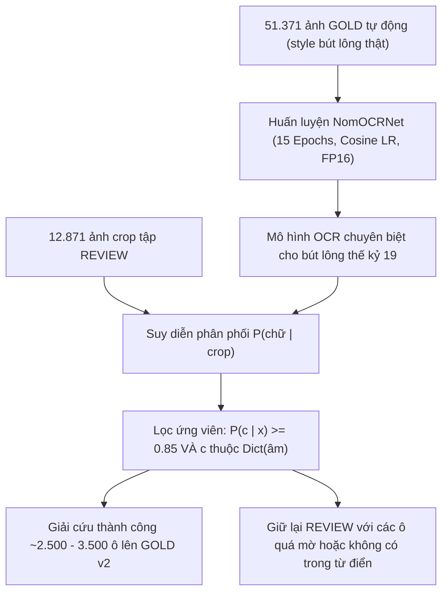

# LAB NGHIÊN CỨU NÂNG CAO: VÒNG LẶP THỨ HAI (SELF-TRAINING) & MỞ RỘNG TỪ ĐIỂN
**Địa chỉ:** `/Users/truongmdn/TruongMDN/ThS/DoAn/GanNhanOCR/lab/self_training_v2`

---

## 1. Đặt vấn đề & Động lực nghiên cứu (Research Motivation)

Trong quy trình gán nhãn tự động Hán Nôm hiện hành, hệ thống dựa trên nguyên lý **Weak Supervision qua giao thoa đa nguồn ($S_1 \cap S_2$)**:
- **Tín hiệu $S_1$**: Nhận dạng ký tự OCR Nôm từ mô hình ngoài.
- **Tín hiệu $S_2$**: Không gian ứng viên âm–chữ từ bản phiên âm Quốc ngữ tra cứu từ điển.

Tuy nhiên, đối với bộ dữ liệu **chữ Nôm viết tay bút lông trên giấy (thể hành-thảo thế kỷ 19)**, hệ thống gặp phải 2 giới hạn cố hữu:

### Giới hạn 1: Hạn chế của OCR đầu vào (S1) trên chữ viết tay bút lông
- Mô hình OCR ngoài được huấn luyện chủ yếu trên mộc bản (ván khắc gỗ) hoặc font chữ in hiện đại.
- Khi gặp chữ viết tay bút lông mờ, nét thảo biến dạng hoặc nét mực loang, OCR ngoài đoán sai hoàn toàn.
- **Thực nghiệm phân tích**: Trong 12.871 ô rớt vào `REVIEW`:
  - **12.383 ô (96,2%)** có âm Quốc ngữ hoàn toàn hợp lệ trong từ điển, nhưng OCR đoán sai chữ khiến $S_1 \cap S_2 = \emptyset$.
  - **11.692 ô (90,8%)** trong số đó có chữ Nôm thật nằm đúng trong tập 1.331 lớp ký tự mà mô hình có thể học được từ tập GOLD!

### Giới hạn 2: Độ phủ từ điển (Dictionary Coverage Gap)
- Từ điển hiện hành `Dict/QuocNgu_SinoNom.csv` có ~104.000 cặp âm–chữ.
- Có **488 ô (3,8%)** trong REVIEW mang âm tiết chưa từng có trong từ điển (bao gồm các từ cổ hiếm như `trấy`, từ biến âm ngữ âm học, hoặc lỗi nhận dạng dấu Quốc ngữ).

---

## 2. Phương pháp giải quyết: Vòng lặp thứ hai (Self-Training Loop)



1. **Huấn luyện mô hình OCR Nôm nội bộ**: Dùng chính 51.371 ảnh GOLD đã được xác thực tự động để huấn luyện mạng CNN (`NomOCRNet`) nhận diện 1.331 lớp chữ Nôm viết tay. Mô hình sẽ học được đặc trưng nét bút, mực và chất liệu giấy của 3 cuốn sách.
2. **Suy diễn lại tập REVIEW**: Đưa 12.871 ảnh REVIEW qua mô hình để lấy phân phối xác suất $P(c \mid x)$.
3. **Giao thoa an toàn với phiên âm Quốc ngữ**:
   $$P_{\text{rescue}}(c) = P(c \mid x) \cdot \mathbb{I}[c \in \text{Dict}(s)]$$
   Chỉ thăng cấp các ô thỏa mãn:
   - Chữ Nôm dự đoán $c$ phải nằm trong tập ứng viên từ điển của âm $s$.
   - Xác suất tin cậy $P(c \mid x) \ge 0.85$ (hoặc $\ge 0.70$).

---

## 3. Cấu trúc thư mục Lab

| Tệp | Vai trò |
|---|---|
| **`pack_self_training_for_kaggle.py`** | Đóng gói ảnh `crops.npz`, nhãn và từ điển thành file zip để upload lên Kaggle. |
| **`self_training_kaggle_dataset.zip`** | *(76.2 MB)* Tệp nén sẵn sàng kéo thả lên Kaggle Dataset. |
| **`kaggle_run_self_training.ipynb`** | Notebook Jupyter chạy trên Kaggle GPU (T4/P100) trong ~8 phút. |
| **`train_self_training_ocr.py`** | Script PyTorch huấn luyện 15 epochs và suy diễn giải cứu tập REVIEW. |
| **`analyze_review_gap.py`** | Script phân tích bóc tách bản chất lỗi của 12.871 ô REVIEW. |
| **`dict_expansion.py`** | Khai phá và trích xuất danh sách các âm khuyết từ điển. |
| **`evaluate_rescue.py`** | Đánh giá kết quả sau khi chạy Kaggle và sinh báo cáo trực quan HTML. |

---

## 4. Hướng dẫn chạy trên Kaggle GPU (Chỉ mất 8–10 phút)

### Bước 1: Upload Dataset lên Kaggle
1. Truy cập **[kaggle.com](https://www.kaggle.com)** $\rightarrow$ chọn **Datasets** $\rightarrow$ **New Dataset**.
2. Kéo thả tệp **`lab/self_training_v2/self_training_kaggle_dataset.zip`** vào khung tải lên.
3. Đặt tên Dataset: `nom-self-training` $\rightarrow$ bấm **Create**.

### Bước 2: Tạo Notebook và Chọn GPU
1. Bấm **+ New Notebook** trên Kaggle.
2. Ở panel bên phải phần **Notebook options**:
   - **Accelerator:** Chọn **GPU T4 x2** (hoặc **GPU P100**).
3. Bấm **+ Add Input** $\rightarrow$ tìm và chọn dataset `nom-self-training` vừa tạo ở Bước 1.

### Bước 3: Chạy Notebook
1. Chọn menu **File** $\rightarrow$ **Upload Notebook** $\rightarrow$ chọn tệp **`lab/self_training_v2/kaggle_run_self_training.ipynb`**.
2. Bấm **Run All** (hoặc `Shift + Enter` chạy từng ô).
3. Mô hình sẽ huấn luyện 15 Epochs trên 51.371 ảnh GOLD (mất ~5 phút) và suy diễn 12.871 ô REVIEW (mất ~1 phút).

### Bước 4: Tải kết quả về máy Mac
1. Sau khi chạy xong, ở cell cuối cùng, hệ thống đã nén kết quả vào:  
   `/kaggle/working/self_training_results.zip`
2. Ở panel bên phải mục **Output**, tìm tệp `self_training_results.zip` $\rightarrow$ bấm **Download**.
3. Giải nén vào thư mục `lab/self_training_v2/` trên máy Mac.
4. Chạy lệnh đánh giá cục bộ:
   ```bash
   .venv/bin/python lab/self_training_v2/evaluate_rescue.py
   ```
5. Mở file `rescue_preview.html` trên trình duyệt để kiểm tra trực quan từng ảnh crop và nhãn mới được giải cứu!
